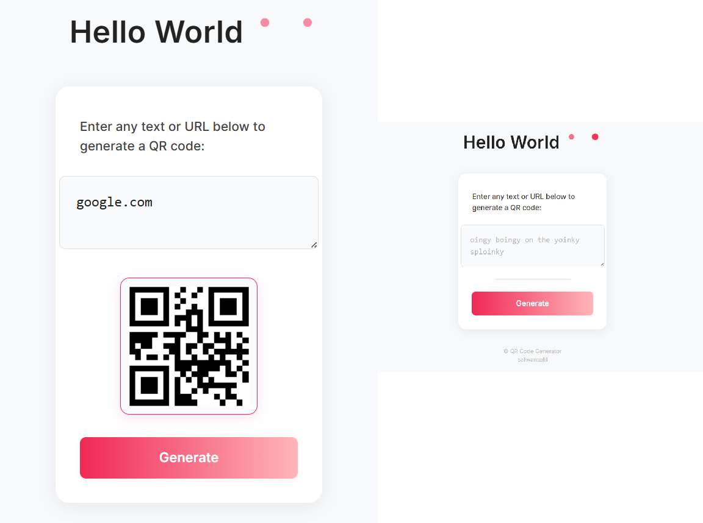

# QR Code Generator

A clean and minimal web app to instantly generate QR codes from any text or URL.

## ✨ Features
- Simple, responsive, and distraction-free UI
- Instantly generates QR codes using a public API
- Supports long and multi-line input

🔗 [Try it live](https://safwansatil.github.io/Qr-Code-Generator/)

## 🚀 Usage
1. Clone or download this repository.
2. Open `index.html` in your browser.
3. Enter your text or URL and click **Generate** to see your QR code.

## 🛠️ Tech Stack
- HTML  
- CSS (custom + Bootstrap)  
- JavaScript  
- [QRServer API](https://goqr.me/api/)

## 💬 Reach Out

Open to feedback, suggestions, or constructive criticism!  
Feel free to connect, collaborate, or let me know how I can improve.

📧 asf1k.til@gmail.com  
🌐 [GitHub](https://www.github.com/safwansatil)
